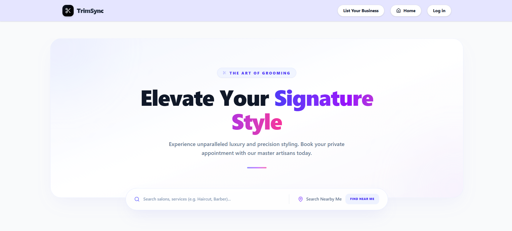
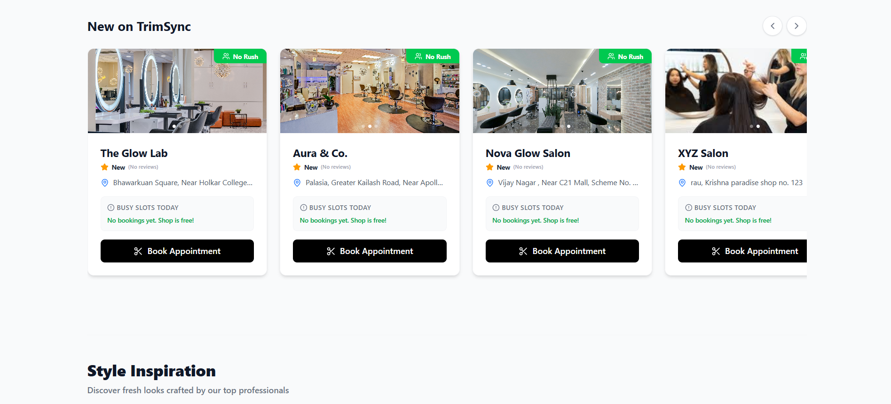
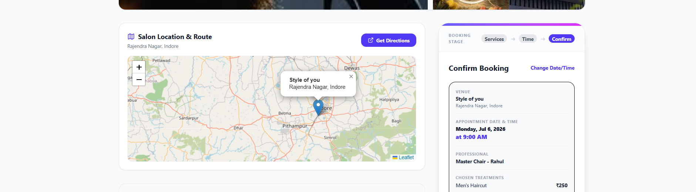
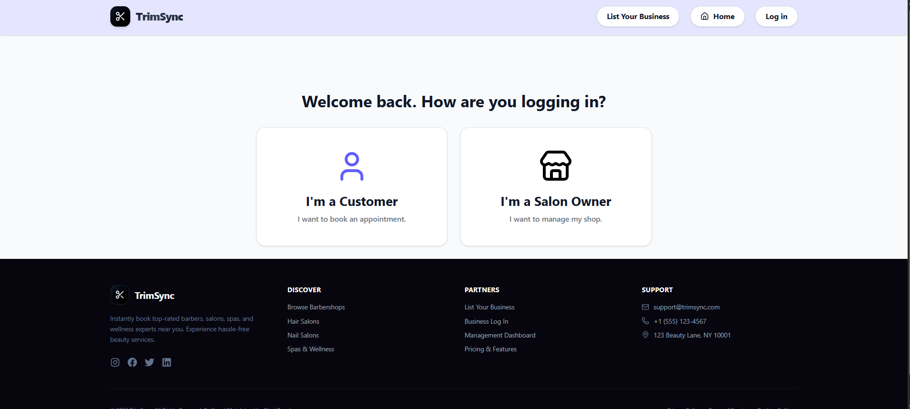

# ✂️ TrimSync - Next-Gen Salon & Barbershop Management


## 📖 Project Description

TrimSync is a full-stack, real-time marketplace and management platform designed to connect customers with top-tier salons and barbershops. It features a stunning, dynamic user interface, real-time queue tracking, and dedicated dashboards tailored for both customers and salon owners. 

By eliminating the wait times and optimizing scheduling, TrimSync breathes fresh air into the salon and barbershop industry.

## 🌐 Live Demo

> **[Live Demo Link: Update if needed]** (e.g., https://trimsync.example.com)

## 📸 Screenshots

<div align="center">









</div>

## ✨ Features

### For Customers
- **Marketplace Discovery:** Browse local salons and barbershops.
- **Live Queue System:** Real-time queue tracking (Socket.io) to see if a chair is occupied or open instantly.
- **Seamless Booking:** Step-by-step interactive booking wizard to pick services, barbers, and times.
- **Customer Dashboard:** Manage profile settings, track past/upcoming appointments, and leave reviews.

### For Salon Owners & Admins
- **Owner Dashboard:** Centralized control panel to manage daily business operations.
- **Real-Time Chair Management:** Mark chairs as free or occupied; push live updates to incoming clients.
- **Service & Portfolio Management:** Upload images directly to Cloudinary and update working hours & services.
- **Super Admin Panel:** Complete oversight over registered salons and users.

## 🤔 Why this project was built

The traditional salon industry struggles with unpredictable wait times and scattered booking systems. TrimSync was built to bridge the gap between walk-ins and appointments through a real-time web-socket architecture, bringing transparency to shop floors.

## 💻 Tech Stack

**Frontend:**
- React 19 (via Vite)
- TailwindCSS 4 (Styling)
- React Router DOM 7
- Socket.io-client
- Axios, Lucide React

**Backend:**
- Node.js & Express 5
- MongoDB (Mongoose 9)
- Socket.io
- JSON Web Tokens (JWT) & bcrypt

**Infrastructure/Cloud:**
- Cloudinary (Image storage)

## 🏛️ Architecture Overview

The system utilizes a modern decoupled client-server architecture:
- **Client Side (SPA):** Built with React. Manages local state (falling back to LocalStorage) and communicates with the backend via RESTful APIs for static data, and WebSockets for real-time queue synchronization.
- **Server Side (API):** Express-driven Node.js backend exposing RESTful JSON endpoints. Utilizes an integrated Socket.io server to broadcast queue changes universally.

## 📂 Folder Structure

```text
TrimSync/
├── client/                     # Frontend Vite + React App
│   ├── public/                 # Static assets
│   ├── src/
│   │   ├── assets/             # Images and design assets
│   │   ├── components/         # Reusable UI components
│   │   ├── hooks/              # Custom React hooks
│   │   ├── pages/              # Primary route pages (Dashboards, Admin)
│   │   ├── utils/              # Frontend helper functions (Time formatters)
│   │   ├── views/              # View aggregates (Marketplace, Booking)
│   │   ├── App.jsx             # Main Router & State logic
│   │   ├── index.css           # Global Tailwind entries
│   │   └── main.jsx            # Entry point
│   ├── package.json
│   ├── vite.config.js
│   └── eslint.config.js
│
└── server/                     # Backend Express App
    ├── middleware/             # Route protection, error handlers
    ├── models/                 # Mongoose schemas (user, salon, booking)
    ├── routes/                 # Express API routes
    ├── services/               # Core business logic / Cloudinary
    ├── utils/                  # Backend helpers
    ├── index.js                # Server entry point & Socket setup
    └── package.json
```

## ⚙️ Installation & Prerequisites

**Prerequisites:**
- Node.js (v18+ recommended)
- MongoDB (Local instance or MongoDB Atlas cluster)

### 1. Clone the repository
```bash
git clone https://github.com/yourusername/TrimSync.git
cd TrimSync
```

### 2. Install Dependencies

**Backend:**
```bash
cd server
npm install
```

**Frontend:**
```bash
cd ../client
npm install
```

## 🔐 Environment Variables

Create a `.env` file in the **`server`** directory based on the following template:

```env
PORT=5000
MONGO_URI=your_mongodb_connection_string
JWT_SECRET=your_super_secret_jwt_key
CLIENT_URL=http://localhost:5173

# Cloudinary Integration (Image Uploads)
CLOUDINARY_CLOUD_NAME=your_cloudinary_name
CLOUDINARY_API_KEY=your_cloudinary_api_key
CLOUDINARY_API_SECRET=your_cloudinary_api_secret
```

Create a `.env` (or `.env.local`) file in the **`client`** directory:

```env
VITE_API_URL=http://localhost:5000/api
VITE_SOCKET_URL=http://localhost:5000
```

## 🚀 Running Locally

Open two separate terminals.

**Terminal 1 (Backend):**
```bash
cd server
npm run dev
# Starts on http://localhost:5000
```

**Terminal 2 (Frontend):**
```bash
cd client
npm run dev
# Starts on http://localhost:5173
```

## 🏗️ Production Build

To build the React application for production deployment:

```bash
cd client
npm run build
```
This generates a `dist/` folder containing the optimized static assets.

## 📜 Available Scripts

### Client
- `npm run dev` - Starts Vite dev server.
- `npm run build` - Builds for production.
- `npm run preview` - Locally preview production build.
- `npm run lint` - Run ESLint.

### Server
- `npm run dev` - Starts nodemon for hot-reloading.
- `npm start` - Starts standard Node process.

## 🧩 Project Structure Explanation

- **Client Routes/Views:** Complex UI state is separated between `views/` (for public heavy-lifting pages like the Marketplace and Booking flow) and `pages/` (Dashboards tailored per role).
- **Backend Models:** Segmented clearly into `user_models.js`, `salon_models.js`, and `booking_models.js` for modular maintainability.

## 🗺️ Routing Overview

**Frontend Routes (`client/src/App.jsx`):**
- `/` - MarketplaceView (Public)
- `/book` - BookingView (Protected / Prompts Login)
- `/login`, `/register` - Authentication Views (Public)
- `/customer` - CustomerDashboard (Customer Role)
- `/owner` - OwnerDashboard (Owner Role)
- `/admin` - SuperAdminPanel (Admin Role)

**Backend API Routes (`server/routes/`):**
- `/api/salons` - Salon listing, details, and owner management.
- `/api/users` - Authentication (Login, Register), User Profile Management.
- `/api/bookings` - Booking creation, history fetching, and cancellation.

## 🔌 API Documentation

*(Optional: Expand upon endpoints as needed. Here is a brief overview.)*

| Endpoint | Method | Description | Auth Required |
|----------|--------|-------------|---------------|
| `/api/users/register` | `POST` | Create a new user account | No |
| `/api/users/login` | `POST` | Authenticate and return JWT | No |
| `/api/salons` | `GET` | Fetch marketplace salons | No |
| `/api/bookings/create`| `POST` | Create a new appointment | Yes |

## 🗄️ Database Schema Overview

The MongoDB database relies on three core Mongoose Models:
1. **User Schema:** Stores credentials, roles (`customer`, `owner`, `admin`), profile details, and preferences.
2. **Salon Schema:** Stores shop name, location, chairs/barbers array, services list, Cloudinary portfolio URLs, and current live queue statistics.
3. **Booking Schema:** Links `User` and `Salon`, retaining selected services, total price, appointment time, and status (`pending`, `completed`, `cancelled`).

## 🔑 Authentication Flow

1. User registers/logs in via Frontend.
2. Backend validates via `bcrypt` and signs a `jsonwebtoken` (JWT).
3. JWT is returned to the client and stored in `localStorage` or memory.
4. Subsequent API calls attach the JWT to the `Authorization: Bearer <token>` header.
5. Express middleware validates the token before granting access to protected routes.

## 🧠 State Management

- **Local State:** Utilizes React's `useState` and `useEffect` hooks extensively.
- **Persistence:** Real-time synchronization of critical states (selected salon, selected services, date) directly with `localStorage` in `App.jsx` to prevent data loss on accidental refreshes.
- **WebSockets:** Application state responds reactively to `socket.io` events (e.g., `queue_updated`).

## 🧱 Reusable Components

Located in `client/src/components/`, including (but not limited to):
- `Navbar` / `Footer`
- `SalonCard` / `SalonCarousel` / `SalonMap`
- Role-based Route Guards (`ProtectedRoute`, `AdminRoute`, `CustomerRoute`)

## 🪝 Custom Hooks
*(Optional: Expand if custom hooks are added to `client/src/hooks/`)*

## 🛠️ Utilities

Located in `client/src/utils/`:
- `formatTo12Hr.js` - Formats 24h timestamps into user-friendly AM/PM strings.
- `formatRangeTo12Hr.js` - Handles time range strings.
- `getAverageRating.js` - Calculates average star ratings dynamically based on reviews array.

## 📦 Third-Party Libraries

- **Vite & TailwindCSS v4** - Fast bundling and utility-first styling.
- **Express Rate Limit & Helmet** - API security and DDOS mitigation.
- **Cloudinary** - Image hosting and optimization.
- **Lucide React & React Icons** - Iconography.

## 🤖 AI Integrations
*(Not currently present. Update if needed.)*

## 🚀 Deployment Guide

1. **Frontend (Vercel / Netlify / Render):**
   - Connect GitHub repo.
   - Set build command to `npm run build` and publish dir to `dist`.
   - Add `.env` variables to platform settings.
2. **Backend (Render / Railway / Heroku):**
   - Deploy `server/` directory.
   - Attach a MongoDB Atlas cluster URI.
   - Add `.env` secrets.

## 🐳 Docker Setup
*(Optional: Dockerfiles can be added to containerize both the node backend and nginx-served frontend. Update if needed.)*

## ⚡ Performance Optimizations

- **Vite:** Rapid HMR and optimized production rollup builds.
- **Tailwind V4:** JIT compilation guarantees a tiny CSS payload.
- **Image Handling:** Offloading image processing to Cloudinary prevents server bottlenecking.

## 🛡️ Security Features

- **Helmet.js:** Secures Express apps by setting various HTTP headers.
- **Express Rate Limit:** Prevents brute-force attacks against API endpoints.
- **Bcrypt:** Passwords are fully hashed.
- **JWT Middleware:** Role-based access control protecting delicate owner/admin endpoints.

## 📱 Responsive Design Notes

TailwindCSS provides a mobile-first approach. The UI uses extensive `md:` and `lg:` breakpoints to ensure the complex dashboards scale elegantly from smartphone screens to desktop monitors.

## 🌍 Browser Compatibility

Supports all modern evergreen browsers (Chrome, Firefox, Safari, Edge).

## ♿ Accessibility Features

*(Optional: Update to note specific ARIA labels, color contrast ratios, or keyboard navigation implementations applied.)*

## 🚨 Error Handling Strategy & Logging

- **Frontend:** Axios interceptors and localized try/catch blocks render user-friendly UI toast/error messages.
- **Backend:** Express error middlewares catch thrown errors to prevent server crashing and return standardized JSON `{ message: "Error details" }` responses.

## 🧪 Validation & Testing

- **Backend:** Payload validation implemented using `express-validator` to ensure clean database writes.
- *(Optional: Add Jest/Cypress testing suites if needed in the future.)*

## 🐛 Debugging Tips

- Ensure MongoDB is actively running before starting the Express server.
- Verify `Socket.io` connection logs in Terminal 1 (Backend). Check for CORS issues if the frontend fails to connect.
- Use the Browser DevTools (Network / Application tabs) to inspect JWT tokens and LocalStorage keys (`trimSync_selectedSalon`).

## ❓ Common Issues & Solutions (FAQ)

- **Q: My queue won't update in real-time?**
  A: Ensure `VITE_SOCKET_URL` in your `.env` perfectly matches the backend running port without trailing slashes.
- **Q: Image uploads are failing.**
  A: Double-check your Cloudinary API keys and ensure your network doesn't block outgoing POSTs to the Cloudinary API.

## 🛣️ Project Roadmap & Future Improvements

- [ ] Implement integrated Payment Gateways (Stripe / PayPal).
- [ ] Add SMS / Email notifications for booking confirmations.
- [ ] Advanced analytical charts for the Salon Owner Dashboard.
- [ ] Migrate to TypeScript for enhanced type safety.

## 🤝 Contributing Guide

1. Fork the repository.
2. Create a new Feature branch (`git checkout -b feature/AmazingFeature`).
3. Commit your changes (`git commit -m 'Add some AmazingFeature'`).
4. Push to the branch (`git push origin feature/AmazingFeature`).
5. Open a Pull Request.

## 📏 Coding Standards & Git Workflow

- Prefer functional React components with Hooks.
- Keep backend controllers lean; abstract heavy logic into `services/`.
- Use descriptive commit messages.

## 📄 License

Distributed under the **ISC** License. See `package.json` for more information.

## 👏 Credits & Acknowledgements

- Built using the incredible [MERN Stack](https://www.mongodb.com/mern-stack).
- Icons provided by [Lucide](https://lucide.dev/) and [React Icons](https://react-icons.github.io/react-icons/).

## 📞 Contact Information

- **Name:** [Your Name / Update if needed]
- **Email:** [Your Email / Update if needed]
- **Project Link:** [Update if needed]

## 🌐 Social Links
- [LinkedIn](#) *(Update if needed)*
- [Twitter](#) *(Update if needed)*

## 🧑‍💻 Author Information

Created by **[Your Name/Team Placeholder]** as a modern solution to the age-old barber waiting line problem.

## 💬 Support

If you run into any issues, please open an **Issue** on GitHub, and we'll get back to you as soon as possible.

## ⭐ Star the Repository!

If you find TrimSync helpful or inspiring, please give it a star on GitHub! It helps immensely.

---

### 📝 Changelog

*(Placeholder: Update as new versions are released)*

### 🔄 Version History

- **v1.0.0** - Initial Release (Marketplace, Booking, WebSockets, Dashboards).

### ⚠️ Known Limitations
- Real-time features require a persistent internet connection (no offline fallback currently).

### 🔧 Troubleshooting Guide
See [Common Issues & Solutions (FAQ)](#-common-issues--solutions-faq) for standard troubleshooting steps. If the Node.js server immediately exits, it is highly likely that the `MONGO_URI` is incorrect or missing.
